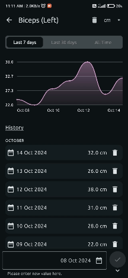

<h1 align = "center">
<b><i>MeasureMate Android App</i></b>
</h1>

Welcome to the **MeasureMate** Android app repository! This project is a part of my premium course on Udemy, where we build a comprehensive Android application using the latest tools and best practices in the industry.

# :building_construction: Tech Stack :building_construction:

- **Jetpack Compose:** To build the User Interface
- **Material 3:** To Design a beautiful and consistent UI.
- **Firebase Authentication:** To securely manage user sign-ins, including Google Sign-In.
- **Firebase Firestore:** To store, sync, and query data in real-time.
- **Splash Screen:** To create a captivating splash screen for our app.
- **Dagger Hilt:** To Manage dependency injection for cleaner, modular code.
- **Compose Navigation:** To Navigate between screens seamlessly.
- **Coil:** To Load and display images effortlessly.

# :camera_flash: **Screenshots** :camera_flash:

| Sign In/Out                       | Add/Update                        | Splash Screen                     |
|-----------------------------------|-----------------------------------|-----------------------------------|
|  |   |  |
| Dashboard Screen                  | Details Screen                    | Input New Value                   | 
|  |   |  |

# :hammer_and_wrench: Udemy Course :hammer_and_wrench:

🎥 Check out the course here: [MeasureMate Android App](https://www.udemy.com/course/measuremate/?referralCode=B3DE352F96BC3C3E9E80)

.jpg)
